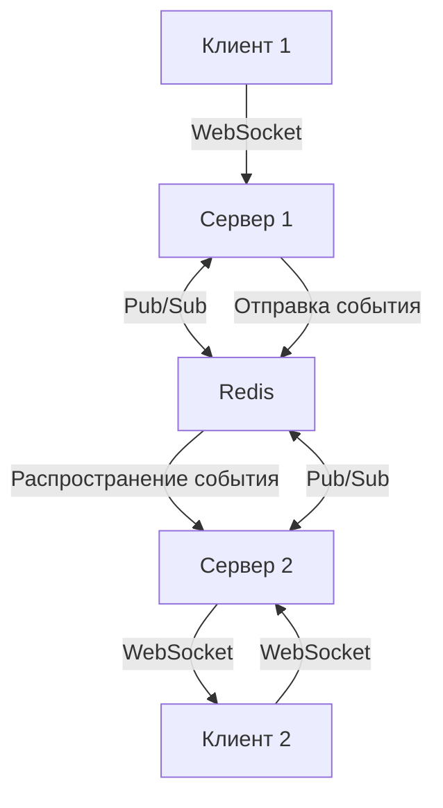

# Mock Interview Application

Приложение для проведения mock-интервью с поддержкой локальной разработки и Docker.

## Быстрый старт

### 🚀 Локальная разработка (рекомендуется)

```bash
git clone <repository-url>
cd SuperMosk2
./start-dev.sh
```

### 🐳 Docker (продакшн-версия)

```bash
./start-docker.sh
```

## Технологии

- **Frontend**: React + Vite + TypeScript + Material-UI
- **Backend**: Node.js + Express + TypeScript + Prisma
- **Database**: PostgreSQL
- **Cache**: Redis
- **Real-time**: Socket.io (WebSocket)

## Адреса

- **Frontend**: http://localhost:5174
- **Backend API**: http://localhost:3000
- **Database**: localhost:5432
- **Redis**: localhost:6379

## Документация

Подробные инструкции по разработке смотрите в [DEVELOPMENT.md](./DEVELOPMENT.md)

## Структура проекта

```
SuperMosk2/
├── frontend/           # React приложение
├── backend/            # Node.js API
├── start-dev.sh        # Скрипт локальной разработки
├── start-docker.sh     # Скрипт Docker запуска
└── DEVELOPMENT.md      # Подробная документация
```

## Архитектура реального времени

### WebSocket (Socket.io)

В приложении Socket.io используется для обеспечения **реал-тайм коммуникации** между клиентами и сервером:

1. **Обновление списка доступных собеседований в реальном времени** - список виден всем в режиме онлайн без перезагрузок (как на бирже)
2. **Мгновенные уведомления** при важных событиях:
   - Бронирование временного слота
   - Отмена бронирования
   - Напоминания о предстоящих собеседованиях
   - Получение обратной связи после собеседования
3. **Обновление статусов** - изменения статусов бронирований и временных слотов отображаются мгновенно

### Redis

Redis выполняет несколько критически важных функций:

1. **Кэширование данных** - снижение нагрузки на PostgreSQL и ускорение ответов
2. **Хранение состояния сессий** - важно для микросервисной архитектуры
3. **Поддержка реал-тайм функциональности** - брокер сообщений для Socket.io
4. **Очереди задач** - обработка уведомлений и фоновых задач

### Взаимодействие WebSocket и Redis



Redis используется как Pub/Sub механизм для Socket.io, что позволяет:

- Масштабировать приложение на несколько серверов
- Синхронизировать события между разными экземплярами
- Обеспечивать надежную доставку сообщений

## Требования

- Node.js 18+
- Docker & Docker Compose
- npm 8+

## Лицензия

ISC
