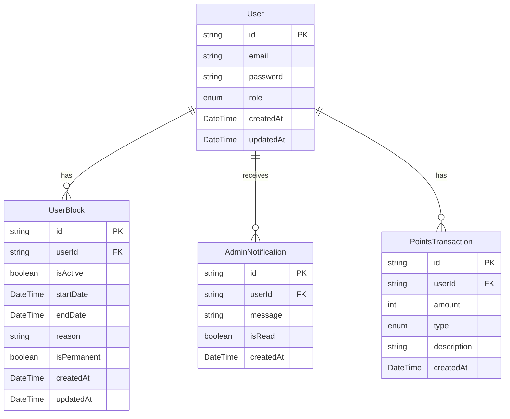
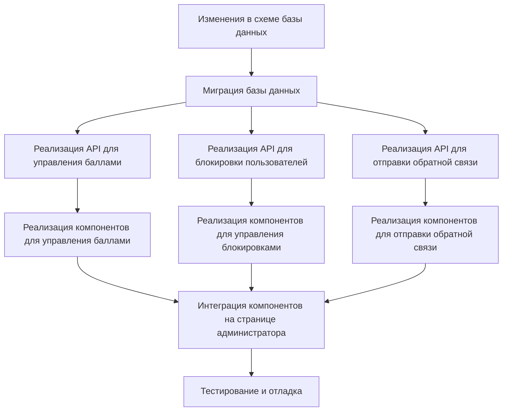

# План реализации функционала администратора

## Текущее состояние проекта

### База данных

- Модель `User` с полем `role` (USER, INTERVIEWER, ADMIN)
- Модель `PointsTransaction` для учета баллов пользователей
- Модель `BookingNotification` для уведомлений, связанных с бронированиями
- Отсутствует модель для блокировки пользователей

### API

- Контроллер `points.controller.ts` для работы с баллами (добавление баллов, получение баланса и истории)
- Контроллер `notification.controller.ts` для работы с уведомлениями (сейчас использует моковые данные)
- Маршруты для работы с баллами и уведомлениями

### Фронтенд

- Страница `AdminPage.tsx`, которая сейчас позволяет управлять только интересами пользователей

## План изменений

### 1. Изменения в схеме базы данных



#### 1.1. Добавить новую модель `UserBlock` для хранения информации о блокировках пользователей:

```prisma
model UserBlock {
  id          String    @id @default(uuid())
  userId      String
  user        User      @relation(fields: [userId], references: [id])
  isActive    Boolean   @default(true)
  startDate   DateTime  @default(now())
  endDate     DateTime?
  reason      String
  isPermanent Boolean   @default(false)
  createdAt   DateTime  @default(now())
  updatedAt   DateTime  @updatedAt
}
```

- [ ] Реализовано

#### 1.2. Добавить новую модель `AdminNotification` для системных уведомлений от администратора:

```prisma
model AdminNotification {
  id        String   @id @default(uuid())
  userId    String
  user      User     @relation(fields: [userId], references: [id])
  message   String
  isRead    Boolean  @default(false)
  createdAt DateTime @default(now())
}
```

- [ ] Реализовано

#### 1.3. Обновить модель `User` для связи с новыми моделями:

```prisma
model User {
  // Существующие поля...
  blocks       UserBlock[]
  adminNotifications AdminNotification[]
}
```

- [ ] Реализовано

#### 1.4. Создать и применить миграцию базы данных

- [ ] Реализовано

### 2. Изменения в API

#### 2.1. Управление баллами пользователей

##### 2.1.1. Добавить новые методы в `points.controller.ts`:

- [ ] `addPointsByAdmin` - добавление баллов пользователю администратором
- [ ] `subtractPointsByAdmin` - вычитание баллов у пользователя администратором
- [ ] `getUserPointsBalanceByAdmin` - получение баланса баллов пользователя администратором
- [ ] `getUserPointsTransactionsByAdmin` - получение истории транзакций пользователя администратором

##### 2.1.2. Добавить новые маршруты в `points.routes.ts`:

- [ ] `POST /api/points/admin/:userId/add` - добавление баллов пользователю
- [ ] `POST /api/points/admin/:userId/subtract` - вычитание баллов у пользователя
- [ ] `GET /api/points/admin/:userId/balance` - получение баланса баллов пользователя
- [ ] `GET /api/points/admin/:userId/transactions` - получение истории транзакций пользователя

#### 2.2. Блокировка аккаунтов пользователей

##### 2.2.1. Создать новый контроллер `user-block.controller.ts`:

- [ ] `blockUser` - блокировка пользователя (временная или постоянная)
- [ ] `unblockUser` - разблокировка пользователя
- [ ] `getUserBlocks` - получение истории блокировок пользователя
- [ ] `getAllActiveBlocks` - получение всех активных блокировок

##### 2.2.2. Создать новые маршруты в `user-block.routes.ts`:

- [ ] `POST /api/user-blocks` - блокировка пользователя
- [ ] `DELETE /api/user-blocks/:id` - разблокировка пользователя
- [ ] `GET /api/user-blocks/user/:userId` - получение истории блокировок пользователя
- [ ] `GET /api/user-blocks/active` - получение всех активных блокировок

##### 2.2.3. Модифицировать middleware `auth.ts` для проверки блокировки пользователя при аутентификации

- [ ] Добавить проверку на наличие активных блокировок
- [ ] Добавить обработку временных блокировок (проверка срока)

#### 2.3. Отправка обратной связи пользователям

##### 2.3.1. Добавить новые методы в `notification.controller.ts`:

- [ ] `createAdminNotification` - создание уведомления администратором
- [ ] `getUserNotifications` - получение уведомлений пользователя администратором
- [ ] `markAdminNotificationAsRead` - отметка уведомления как прочитанного

##### 2.3.2. Добавить новые маршруты в `notification.routes.ts`:

- [ ] `POST /api/notifications/admin` - создание уведомления администратором
- [ ] `GET /api/notifications/admin/user/:userId` - получение уведомлений пользователя
- [ ] `PATCH /api/notifications/admin/:id/read` - отметка уведомления как прочитанного

### 3. Изменения во фронтенде

#### 3.1. Обновить страницу `AdminPage.tsx`:

- [ ] Добавить табы для переключения между разделами (Интересы, Пользователи, Баллы, Блокировки)
- [ ] Реализовать таблицу пользователей с возможностью поиска и фильтрации

#### 3.2. Создать компоненты для управления баллами:

- [ ] `UserPointsManager.tsx` - компонент для управления баллами пользователя
- [ ] `AddPointsDialog.tsx` - диалог для добавления баллов
- [ ] `SubtractPointsDialog.tsx` - диалог для вычитания баллов
- [ ] `UserTransactionsTable.tsx` - таблица транзакций пользователя

#### 3.3. Создать компоненты для управления блокировками:

- [ ] `UserBlockManager.tsx` - компонент для управления блокировками пользователя
- [x] `BlockUserDialog.tsx` - диалог для блокировки пользователя
- [x] `UserBlocksTable.tsx` - таблица блокировок пользователя

#### 3.4. Создать компоненты для отправки обратной связи:

- [x] `UserFeedbackManager.tsx` - компонент для отправки обратной связи пользователю
- [ ] `SendFeedbackDialog.tsx` - диалог для отправки обратной связи
- [ ] `UserNotificationsTable.tsx` - таблица уведомлений пользователя

### 4. Последовательность реализации



## Чек-лист реализации

### Бэкенд

- [ ] Обновление схемы базы данных
- [ ] Создание миграции
- [ ] Реализация API для управления баллами
- [ ] Реализация API для блокировки пользователей
- [ ] Реализация API для отправки обратной связи
- [ ] Модификация middleware для проверки блокировок

### Фронтенд

- [ ] Обновление страницы администратора
- [ ] Реализация компонентов для управления баллами
- [ ] Реализация компонентов для управления блокировками
- [ ] Реализация компонентов для отправки обратной связи
- [ ] Интеграция всех компонентов

### Тестирование

- [ ] Тестирование API для управления баллами
- [ ] Тестирование API для блокировки пользователей
- [ ] Тестирование API для отправки обратной связи
- [ ] Тестирование интерфейса администратора
