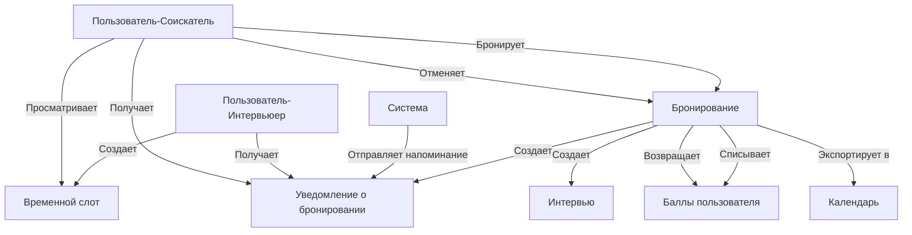

# Архитектура системы бронирования для проекта SuperMosk2

## 1. Модели данных (Prisma схема)

Для реализации системы бронирования нам потребуется добавить следующие модели в существующую схему Prisma:

```prisma
// Временной слот (доступное время для проведения собеседований)
model TimeSlot {
  id            String    @id @default(uuid())
  interviewerId String
  interviewer   User      @relation("InterviewerSlots", fields: [interviewerId], references: [id])
  startTime     DateTime
  endTime       DateTime
  duration      Int       // в минутах
  specialization String
  status        SlotStatus @default(AVAILABLE)
  conferenceLink String?   // ссылка на конференцию
  booking       Booking?
  createdAt     DateTime  @default(now())
  updatedAt     DateTime  @updatedAt
}

// Бронирование (связь между пользователем и временным слотом)
model Booking {
  id            String    @id @default(uuid())
  timeSlotId    String    @unique
  timeSlot      TimeSlot  @relation(fields: [timeSlotId], references: [id])
  participantId String
  participant   User      @relation("ParticipantBookings", fields: [participantId], references: [id])
  status        BookingStatus @default(CONFIRMED)
  interviewId   String?   // Ссылка на интервью, если оно создано
  interview     Interview? @relation(fields: [interviewId], references: [id])
  createdAt     DateTime  @default(now())
  updatedAt     DateTime  @updatedAt
  cancelCount   Int       @default(0) // Счетчик отмен для этого пользователя в текущем месяце
  notifications BookingNotification[]
}

// Уведомление о бронировании
model BookingNotification {
  id            String    @id @default(uuid())
  userId        String
  user          User      @relation(fields: [userId], references: [id])
  bookingId     String?
  booking       Booking?  @relation(fields: [bookingId], references: [id])
  type          NotificationType
  message       String
  isRead        Boolean   @default(false)
  createdAt     DateTime  @default(now())
}

// Обновление существующих моделей
model User {
  // Существующие поля...
  interviewerSlots TimeSlot[] @relation("InterviewerSlots")
  participantBookings Booking[] @relation("ParticipantBookings")
  bookingNotifications BookingNotification[]
}

// Добавление новых перечислений
enum SlotStatus {
  AVAILABLE
  BOOKED
  CANCELLED
}

enum BookingStatus {
  CONFIRMED
  COMPLETED
  CANCELLED
}

enum NotificationType {
  NEW_BOOKING
  BOOKING_REMINDER
  BOOKING_CANCELLED
}
```

## 2. API-эндпоинты

### Эндпоинты для временных слотов

```
GET /api/slots - Получение списка доступных слотов с фильтрацией
GET /api/slots/:id - Получение информации о конкретном слоте
POST /api/slots - Создание нового временного слота
PATCH /api/slots/:id - Обновление информации о слоте
DELETE /api/slots/:id - Удаление временного слота
```

### Эндпоинты для бронирований

```
GET /api/bookings - Получение списка бронирований пользователя
GET /api/bookings/:id - Получение информации о конкретном бронировании
POST /api/bookings - Создание нового бронирования
PATCH /api/bookings/:id/cancel - Отмена бронирования
```

### Эндпоинты для уведомлений о бронировании

```
GET /api/booking-notifications - Получение списка уведомлений о бронировании
PATCH /api/booking-notifications/:id/read - Отметка уведомления как прочитанного
```

### Эндпоинты для интеграции с календарями

```
GET /api/bookings/:id/calendar - Получение данных для экспорта в календарь (.ics)
```

## 3. Диаграмма взаимодействия компонентов



## 4. Интеграция с существующими компонентами

### Интеграция с системой пользователей

- Использование существующей модели User для связи с временными слотами и бронированиями
- Расширение профиля пользователя для отображения статистики бронирований

### Интеграция с системой собеседований

- Связь бронирования с интервью через поле interviewId
- Автоматическое создание интервью при подтверждении бронирования
- Обновление статуса интервью при изменении статуса бронирования

### Интеграция с системой баллов

- Списание баллов при создании бронирования
- Возврат баллов при отмене бронирования (с учетом правил отмены)
- Начисление баллов интервьюеру после завершения собеседования

### Интеграция с системой уведомлений

- Создание уведомлений о новых бронированиях
- Создание напоминаний о предстоящих собеседованиях
- Создание уведомлений об отмене бронирований

## 5. Бизнес-правила системы бронирования

1. Пользователь должен иметь минимум 1 балл для бронирования собеседования
2. При бронировании списывается 1 балл
3. При отмене бронирования возвращается 1 балл (с учетом ограничений)
4. Не более 3 отмен в месяц без штрафа, после чего вводится штраф в 1 дополнительный балл
5. После завершения собеседования интервьюер получает 1 балл
6. Временной слот становится недоступным для бронирования после его бронирования
7. Пользователь может видеть ссылку на конференцию только после бронирования слота

## 6. Контроллеры и схемы валидации

### Контроллер временных слотов (TimeSlotController)

```typescript
// Создание временного слота
export const createTimeSlot = async (
  req: AuthenticatedRequest,
  res: Response
) => {
  try {
    const { startTime, endTime, duration, specialization, conferenceLink } =
      req.body;

    const newTimeSlot = await prisma.timeSlot.create({
      data: {
        interviewerId: req.user.id,
        startTime: new Date(startTime),
        endTime: new Date(endTime),
        duration,
        specialization,
        conferenceLink,
        status: 'AVAILABLE',
      },
    });

    res.status(201).json(newTimeSlot);
  } catch (error) {
    console.error('Error creating time slot:', error);
    res.status(500).json({ error: 'Failed to create time slot' });
  }
};

// Получение списка доступных слотов
export const getTimeSlots = async (
  req: AuthenticatedRequest,
  res: Response
) => {
  try {
    const { specialization, startDate, endDate } = req.query;

    const whereConditions: any = {
      status: 'AVAILABLE',
    };

    if (specialization) {
      whereConditions.specialization = specialization as string;
    }

    if (startDate) {
      whereConditions.startTime = {
        gte: new Date(startDate as string),
      };
    }

    if (endDate) {
      whereConditions.endTime = {
        lte: new Date(endDate as string),
      };
    }

    const timeSlots = await prisma.timeSlot.findMany({
      where: whereConditions,
      include: {
        interviewer: {
          include: {
            profile: true,
          },
        },
      },
      orderBy: {
        startTime: 'asc',
      },
    });

    res.json(timeSlots);
  } catch (error) {
    console.error('Error fetching time slots:', error);
    res.status(500).json({ error: 'Failed to fetch time slots' });
  }
};
```

### Контроллер бронирований (BookingController)

```typescript
// Создание бронирования
export const createBooking = async (
  req: AuthenticatedRequest,
  res: Response
) => {
  try {
    const { timeSlotId } = req.body;

    // Проверка наличия баллов у пользователя
    const userPoints = await getUserPoints(req.user.id);
    if (userPoints < 1) {
      return res
        .status(400)
        .json({ error: 'Недостаточно баллов для бронирования' });
    }

    // Проверка доступности слота
    const timeSlot = await prisma.timeSlot.findFirst({
      where: {
        id: timeSlotId,
        status: 'AVAILABLE',
      },
    });

    if (!timeSlot) {
      return res
        .status(404)
        .json({ error: 'Временной слот не найден или уже забронирован' });
    }

    // Создание бронирования в транзакции
    const booking = await prisma.$transaction(async (prisma) => {
      // Обновление статуса слота
      await prisma.timeSlot.update({
        where: { id: timeSlotId },
        data: { status: 'BOOKED' },
      });

      // Создание бронирования
      const newBooking = await prisma.booking.create({
        data: {
          timeSlotId,
          participantId: req.user.id,
          status: 'CONFIRMED',
        },
      });

      // Списание баллов
      await prisma.pointsTransaction.create({
        data: {
          userId: req.user.id,
          amount: -1,
          type: 'SPENT',
          description: `Бронирование собеседования #${newBooking.id}`,
        },
      });

      // Создание уведомления для интервьюера
      await prisma.bookingNotification.create({
        data: {
          userId: timeSlot.interviewerId,
          bookingId: newBooking.id,
          type: 'NEW_BOOKING',
          message: `Ваш временной слот был забронирован на ${formatDate(
            timeSlot.startTime
          )}`,
        },
      });

      return newBooking;
    });

    res.status(201).json(booking);
  } catch (error) {
    console.error('Error creating booking:', error);
    res.status(500).json({ error: 'Failed to create booking' });
  }
};

// Отмена бронирования
export const cancelBooking = async (
  req: AuthenticatedRequest,
  res: Response
) => {
  try {
    const { id } = req.params;

    // Проверка существования бронирования
    const booking = await prisma.booking.findFirst({
      where: {
        id,
        participantId: req.user.id,
        status: 'CONFIRMED',
      },
      include: {
        timeSlot: true,
      },
    });

    if (!booking) {
      return res
        .status(404)
        .json({ error: 'Бронирование не найдено или уже отменено' });
    }

    // Проверка количества отмен в текущем месяце
    const currentMonth = new Date();
    currentMonth.setDate(1);
    currentMonth.setHours(0, 0, 0, 0);

    const cancelCount = await prisma.booking.count({
      where: {
        participantId: req.user.id,
        status: 'CANCELLED',
        updatedAt: {
          gte: currentMonth,
        },
      },
    });

    // Определение штрафа за отмену
    const penaltyPoints = cancelCount >= 3 ? 1 : 0;
    const refundPoints = 1 - penaltyPoints;

    // Отмена бронирования в транзакции
    await prisma.$transaction(async (prisma) => {
      // Обновление статуса бронирования
      await prisma.booking.update({
        where: { id },
        data: {
          status: 'CANCELLED',
          cancelCount: cancelCount + 1,
        },
      });

      // Обновление статуса временного слота
      await prisma.timeSlot.update({
        where: { id: booking.timeSlotId },
        data: { status: 'AVAILABLE' },
      });

      // Возврат баллов (с учетом штрафа)
      if (refundPoints > 0) {
        await prisma.pointsTransaction.create({
          data: {
            userId: req.user.id,
            amount: refundPoints,
            type: 'REFUNDED',
            description: `Возврат баллов за отмену бронирования #${booking.id}`,
          },
        });
      }

      // Создание уведомления для интервьюера
      await prisma.bookingNotification.create({
        data: {
          userId: booking.timeSlot.interviewerId,
          bookingId: booking.id,
          type: 'BOOKING_CANCELLED',
          message: `Бронирование на ${formatDate(
            booking.timeSlot.startTime
          )} было отменено`,
        },
      });
    });

    res.json({
      message: 'Бронирование успешно отменено',
      refundedPoints: refundPoints,
      penaltyPoints: penaltyPoints,
    });
  } catch (error) {
    console.error('Error cancelling booking:', error);
    res.status(500).json({ error: 'Failed to cancel booking' });
  }
};
```

## 7. Схемы валидации (Zod)

```typescript
// Схема для создания временного слота
export const createTimeSlotSchema = z.object({
  startTime: z.string().datetime('Неверный формат даты и времени начала'),
  endTime: z.string().datetime('Неверный формат даты и времени окончания'),
  duration: z
    .number()
    .min(15, 'Продолжительность должна быть минимум 15 минут'),
  specialization: z
    .string()
    .min(2, 'Специализация должна содержать минимум 2 символа'),
  conferenceLink: z
    .string()
    .url('Неверный формат ссылки на конференцию')
    .optional(),
});

// Схема для создания бронирования
export const createBookingSchema = z.object({
  timeSlotId: z.string().uuid('Неверный формат UUID временного слота'),
});

// Схема для параметров запроса временных слотов
export const getTimeSlotsParamsSchema = z.object({
  specialization: z.string().optional(),
  startDate: z.string().datetime('Неверный формат даты начала').optional(),
  endDate: z.string().datetime('Неверный формат даты окончания').optional(),
});
```

## 8. Маршруты (Routes)

```typescript
// Маршруты для временных слотов
router.get(
  '/slots',
  validate(z.object({ query: getTimeSlotsParamsSchema })),
  getTimeSlots
);
router.get(
  '/slots/:id',
  validate(z.object({ params: idParamSchema })),
  getTimeSlotById
);
router.post(
  '/slots',
  validate(z.object({ body: createTimeSlotSchema })),
  createTimeSlot
);
router.patch(
  '/slots/:id',
  validate(z.object({ params: idParamSchema, body: updateTimeSlotSchema })),
  updateTimeSlot
);
router.delete(
  '/slots/:id',
  validate(z.object({ params: idParamSchema })),
  deleteTimeSlot
);

// Маршруты для бронирований
router.get('/bookings', getBookings);
router.get(
  '/bookings/:id',
  validate(z.object({ params: idParamSchema })),
  getBookingById
);
router.post(
  '/bookings',
  validate(z.object({ body: createBookingSchema })),
  createBooking
);
router.patch(
  '/bookings/:id/cancel',
  validate(z.object({ params: idParamSchema })),
  cancelBooking
);

// Маршруты для уведомлений о бронировании
router.get('/booking-notifications', getBookingNotifications);
router.patch(
  '/booking-notifications/:id/read',
  validate(z.object({ params: idParamSchema })),
  markBookingNotificationAsRead
);

// Маршруты для интеграции с календарями
router.get(
  '/bookings/:id/calendar',
  validate(z.object({ params: idParamSchema })),
  getBookingCalendarData
);
```

## 9. Вспомогательные функции

```typescript
// Получение баланса баллов пользователя
export const getUserPoints = async (userId: string): Promise<number> => {
  const transactions = await prisma.pointsTransaction.findMany({
    where: { userId },
  });

  return transactions.reduce(
    (total, transaction) => total + transaction.amount,
    0
  );
};

// Форматирование даты
export const formatDate = (date: Date): string => {
  return new Intl.DateTimeFormat('ru-RU', {
    day: '2-digit',
    month: '2-digit',
    year: 'numeric',
    hour: '2-digit',
    minute: '2-digit',
  }).format(date);
};

// Создание файла .ics для экспорта в календарь
export const createICSFile = (booking: any): string => {
  const startDate = new Date(booking.timeSlot.startTime);
  const endDate = new Date(booking.timeSlot.endTime);

  return `BEGIN:VCALENDAR
VERSION:2.0
PRODID:-//SuperMosk2//RU
CALSCALE:GREGORIAN
BEGIN:VEVENT
SUMMARY:Собеседование: ${booking.timeSlot.specialization}
DTSTART:${formatICSDate(startDate)}
DTEND:${formatICSDate(endDate)}
DESCRIPTION:Собеседование по специализации ${booking.timeSlot.specialization}
LOCATION:${booking.timeSlot.conferenceLink || 'Онлайн'}
STATUS:CONFIRMED
END:VEVENT
END:VCALENDAR`;
};

// Форматирование даты для .ics файла
export const formatICSDate = (date: Date): string => {
  return date.toISOString().replace(/[-:]/g, '').split('.')[0] + 'Z';
};
```
