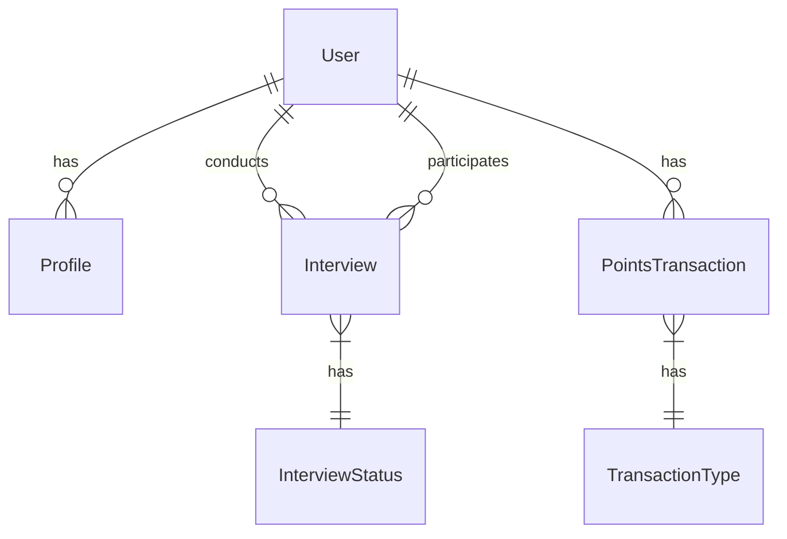

# 🎨🎨🎨 ENTERING CREATIVE PHASE: DATA MODEL 🎨🎨🎨

## PROBLEM STATEMENT
Design a robust and flexible data model for the Mock Interview Application that:
1. Supports user authentication and profile management
2. Enables interview scheduling and management
3. Tracks points and transactions
4. Maintains data integrity and relationships
5. Allows for future feature extensions

## OPTIONS ANALYSIS

### Option 1: Simple Relational Model
**Description**: Basic tables with minimal relationships
**Pros**:
- Simple to understand and implement
- Easy to query and maintain
- Good for small-scale applications
**Cons**:
- Limited flexibility
- Potential for data redundancy
- Harder to extend
**Complexity**: Low
**Implementation Time**: 1-2 weeks

### Option 2: Normalized Relational Model
**Description**: Highly normalized tables with complex relationships
**Pros**:
- Data integrity
- No redundancy
- Efficient storage
**Cons**:
- Complex queries
- Performance overhead
- Harder to maintain
**Complexity**: High
**Implementation Time**: 3-4 weeks

### Option 3: Balanced Relational Model (Selected)
**Description**: Moderately normalized with strategic denormalization
**Pros**:
- Good balance of performance and integrity
- Flexible for future changes
- Maintainable structure
**Cons**:
- Some data redundancy
- Need for careful design
**Complexity**: Medium
**Implementation Time**: 2-3 weeks

## DECISION
Selected Option: Balanced Relational Model

Rationale:
1. Provides good performance while maintaining data integrity
2. Allows for future feature additions
3. Balances complexity with maintainability
4. Supports efficient querying
5. Enables proper relationship management

## IMPLEMENTATION PLAN

### 1. Core Entities

#### User
```prisma
model User {
  id            String    @id @default(uuid())
  email         String    @unique
  password      String
  role          Role      @default(USER)
  createdAt     DateTime  @default(now())
  updatedAt     DateTime  @updatedAt
  profile       Profile?
  interviews    Interview[] @relation("Interviewer")
  participations Interview[] @relation("Participant")
  transactions  PointsTransaction[]
}
```

#### Profile
```prisma
model Profile {
  id            String    @id @default(uuid())
  userId        String    @unique
  user          User      @relation(fields: [userId], references: [id])
  firstName     String
  lastName      String
  avatar        String?
  specialization String
  bio           String?
  createdAt     DateTime  @default(now())
  updatedAt     DateTime  @updatedAt
}
```

#### Interview
```prisma
model Interview {
  id            String    @id @default(uuid())
  title         String
  description   String
  specialization String
  interviewerId String
  interviewer   User      @relation("Interviewer", fields: [interviewerId], references: [id])
  participantId String
  participant   User      @relation("Participant", fields: [participantId], references: [id])
  status        InterviewStatus @default(SCHEDULED)
  scheduledTime DateTime
  duration      Int       // in minutes
  createdAt     DateTime  @default(now())
  updatedAt     DateTime  @updatedAt
}
```

#### PointsTransaction
```prisma
model PointsTransaction {
  id            String    @id @default(uuid())
  userId        String
  user          User      @relation(fields: [userId], references: [id])
  amount        Int
  type          TransactionType
  description   String
  createdAt     DateTime  @default(now())
}
```

### 2. Enums

```prisma
enum Role {
  USER
  INTERVIEWER
  ADMIN
}

enum InterviewStatus {
  SCHEDULED
  IN_PROGRESS
  COMPLETED
  CANCELLED
}

enum TransactionType {
  EARNED
  SPENT
  REFUNDED
}
```

### 3. Relationships Diagram


## DATA INTEGRITY RULES

1. User Management
   - Email must be unique
   - Password must be hashed
   - Role must be valid
   - Profile is optional but unique per user

2. Interview Management
   - Interviewer and participant must be different users
   - Status transitions must be valid
   - Scheduled time must be in the future
   - Duration must be positive

3. Points System
   - Points cannot be negative
   - Transactions must have valid type
   - User must exist for transaction
   - Description must be provided

## INDEXING STRATEGY

1. Primary Keys
   - UUID for all entities
   - Auto-generated
   - Non-sequential

2. Foreign Keys
   - Indexed for performance
   - Cascading deletes where appropriate
   - Referential integrity enforced

3. Search Fields
   - Email (unique)
   - Specialization
   - Interview status
   - Transaction type

## DATA VALIDATION

1. Input Validation
   - Email format
   - Password strength
   - Date ranges
   - Numeric constraints

2. Business Rules
   - Role-based permissions
   - Interview scheduling rules
   - Points calculation
   - Status transitions

## MIGRATION STRATEGY

1. Initial Migration
   - Create all tables
   - Set up relationships
   - Add indexes
   - Define constraints

2. Future Migrations
   - Add new fields
   - Modify relationships
   - Update constraints
   - Add new entities

## PERFORMANCE CONSIDERATIONS

1. Query Optimization
   - Proper indexing
   - Efficient joins
   - Pagination
   - Caching strategy

2. Data Access Patterns
   - Read-heavy operations
   - Write patterns
   - Batch operations
   - Real-time updates

## 🎨 CREATIVE CHECKPOINT: DATA MODEL COMPLETE

The data model has been defined with:
- Core entities and relationships
- Data integrity rules
- Indexing strategy
- Validation rules
- Migration plan
- Performance considerations

## 🎨🎨🎨 EXITING CREATIVE PHASE - DECISION MADE 