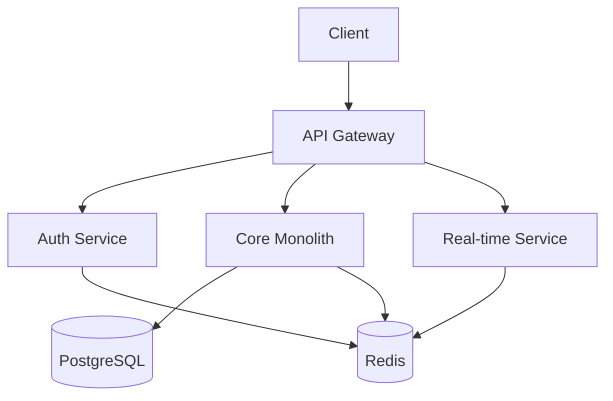
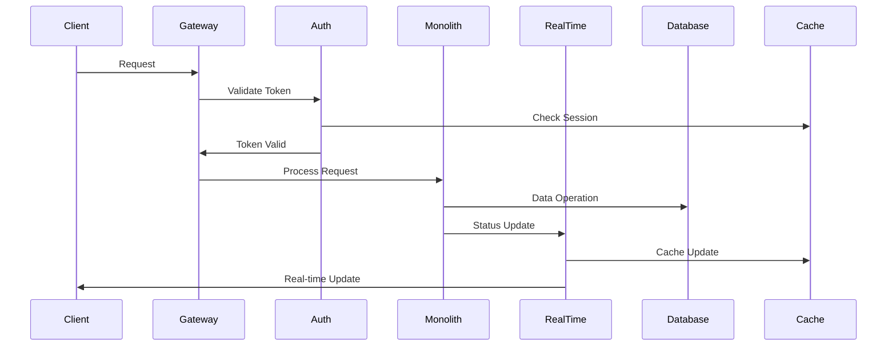

# 🎨🎨🎨 ENTERING CREATIVE PHASE: SYSTEM ARCHITECTURE 🎨🎨🎨

## PROBLEM STATEMENT
Design a scalable and maintainable system architecture for the Mock Interview Application that:
1. Supports real-time interview scheduling and updates
2. Handles concurrent users and interviews
3. Ensures data consistency across services
4. Provides reliable authentication and authorization
5. Enables future scalability and feature additions

## OPTIONS ANALYSIS

### Option 1: Monolithic Architecture with Real-time Extensions
**Description**: Single application with WebSocket integration for real-time features
**Pros**:
- Simpler deployment and maintenance
- Easier development and debugging
- Lower initial complexity
- Single codebase to manage
**Cons**:
- Limited scalability
- All components share resources
- Harder to scale specific features
- Single point of failure
**Complexity**: Low
**Implementation Time**: 2-3 weeks

### Option 2: Microservices Architecture
**Description**: Separate services for different domains with API Gateway
**Pros**:
- Better scalability
- Independent deployment
- Technology flexibility
- Fault isolation
**Cons**:
- Higher complexity
- More infrastructure needed
- Distributed system challenges
- Higher operational overhead
**Complexity**: High
**Implementation Time**: 4-6 weeks

### Option 3: Hybrid Architecture (Selected)
**Description**: Core monolith with microservices for specific features
**Pros**:
- Balanced approach
- Gradual scalability
- Easier initial development
- Flexible service extraction
**Cons**:
- Need to manage both patterns
- Potential technical debt
- More complex deployment
**Complexity**: Medium
**Implementation Time**: 3-4 weeks

## DECISION
Selected Option: Hybrid Architecture

Rationale:
1. Provides a good balance between development speed and scalability
2. Allows for gradual service extraction as needed
3. Reduces initial complexity while maintaining flexibility
4. Easier to manage for a small team
5. Can evolve into full microservices if needed

## IMPLEMENTATION PLAN

### 1. Core Architecture

### 2. Service Breakdown

#### Core Monolith
- User management
- Profile management
- Interview management
- Points system
- Basic admin features

#### Auth Service
- Authentication
- Authorization
- Session management
- JWT handling

#### Real-time Service
- WebSocket connections
- Interview status updates
- Chat functionality
- Notifications

### 3. Data Flow

## TECHNICAL SPECIFICATIONS

### API Gateway
- Express.js with TypeScript
- Rate limiting
- Request validation
- CORS handling
- Load balancing

### Core Monolith
- Express.js with TypeScript
- Prisma ORM
- Redis caching
- JWT validation
- File upload handling

### Auth Service
- Express.js with TypeScript
- JWT generation/validation
- Redis session store
- OAuth integration
- Role-based access control

### Real-time Service
- Socket.io
- Redis pub/sub
- Event-driven architecture
- Connection management
- Message queuing

### Database
- PostgreSQL 14+
- Connection pooling
- Read replicas (future)
- Automated backups
- Data encryption

### Caching
- Redis 6+
- Session storage
- Real-time data
- API response caching
- Rate limiting

## SCALING STRATEGY

### Horizontal Scaling
1. Load balancer for API Gateway
2. Multiple instances of services
3. Database read replicas
4. Redis cluster

### Vertical Scaling
1. Increased server resources
2. Optimized database queries
3. Efficient caching
4. Connection pooling

## SECURITY MEASURES

1. Authentication
   - JWT with refresh tokens
   - Secure password hashing
   - Rate limiting
   - Session management

2. Authorization
   - Role-based access control
   - Resource-level permissions
   - API key management
   - Audit logging

3. Data Protection
   - Data encryption at rest
   - TLS for all communications
   - Input validation
   - SQL injection prevention

## MONITORING AND LOGGING

1. Application Monitoring
   - Request/response logging
   - Error tracking
   - Performance metrics
   - Resource usage

2. Infrastructure Monitoring
   - Server health
   - Database performance
   - Cache hit rates
   - Network latency

## 🎨 CREATIVE CHECKPOINT: SYSTEM ARCHITECTURE COMPLETE

The system architecture has been defined with:
- Hybrid architecture approach
- Service breakdown
- Data flow patterns
- Technical specifications
- Scaling strategy
- Security measures
- Monitoring plan

## 🎨🎨🎨 EXITING CREATIVE PHASE - DECISION MADE 