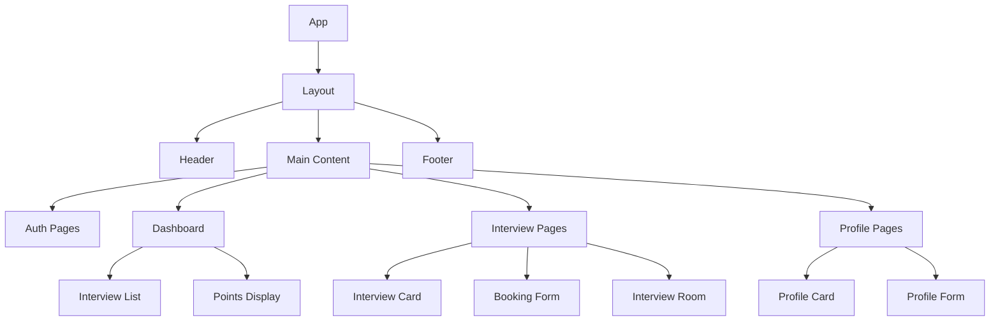
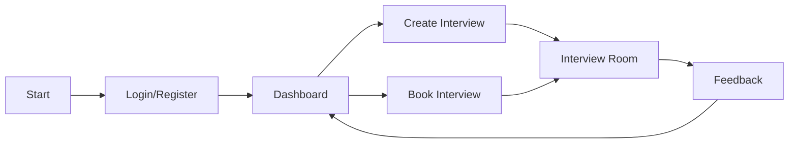

# 🎨🎨🎨 ENTERING CREATIVE PHASE: UI/UX DESIGN SYSTEM 🎨🎨🎨

## PROBLEM STATEMENT
Design a comprehensive UI/UX system for the Mock Interview Application that provides:
1. Intuitive user flows for interview scheduling and participation
2. Clear visual hierarchy for interview listings and booking
3. Responsive design for all device sizes
4. Accessible interface following WCAG guidelines
5. Consistent design language across all features

## OPTIONS ANALYSIS

### Option 1: Material-UI with Custom Theme
**Description**: Use Material-UI as the base component library with a custom theme and additional components
**Pros**:
- Rich component library with accessibility built-in
- Well-documented and maintained
- Large community support
- Built-in responsive design
- Easy to customize with theming
**Cons**:
- Can look generic without significant customization
- Bundle size can be large
- Some components may be over-engineered for simple use cases
**Complexity**: Medium
**Implementation Time**: 2-3 weeks

### Option 2: Custom Component Library with Styled Components
**Description**: Build a custom component library using styled-components
**Pros**:
- Complete design freedom
- Smaller bundle size
- No unused components
- Perfect brand alignment
**Cons**:
- Longer development time
- Need to build accessibility features
- More maintenance overhead
- Need to create documentation
**Complexity**: High
**Implementation Time**: 4-6 weeks

### Option 3: Chakra UI with Custom Extensions
**Description**: Use Chakra UI as the base with custom extensions
**Pros**:
- Modern, accessible components
- Smaller bundle size than Material-UI
- Easy to customize
- Good developer experience
**Cons**:
- Smaller community than Material-UI
- Fewer pre-built components
- May need to build some complex components
**Complexity**: Medium
**Implementation Time**: 2-4 weeks

## DECISION
Selected Option: Material-UI with Custom Theme

Rationale:
1. Provides the best balance of development speed and customization
2. Strong accessibility features out of the box
3. Large community support for troubleshooting
4. Well-documented theming system
5. Can be gradually customized over time

## IMPLEMENTATION PLAN

### 1. Theme Setup
```typescript
// theme.ts
import { createTheme } from '@mui/material/styles';

export const theme = createTheme({
  palette: {
    primary: {
      main: '#2196f3',
      light: '#64b5f6',
      dark: '#1976d2',
    },
    secondary: {
      main: '#f50057',
      light: '#ff4081',
      dark: '#c51162',
    },
  },
  typography: {
    fontFamily: '"Roboto", "Helvetica", "Arial", sans-serif',
    h1: {
      fontSize: '2.5rem',
      fontWeight: 500,
    },
    // ... other typography settings
  },
  components: {
    MuiButton: {
      styleOverrides: {
        root: {
          borderRadius: 8,
        },
      },
    },
    // ... other component customizations
  },
});
```

### 2. Component Library Structure
```
src/
  components/
    common/
      Button/
      Input/
      Card/
      Modal/
    layout/
      Header/
      Sidebar/
      Footer/
    features/
      interview/
        InterviewCard/
        InterviewList/
        BookingForm/
      profile/
        ProfileCard/
        ProfileForm/
      points/
        PointsDisplay/
        TransactionHistory/
```

### 3. Design System Documentation
- Component usage guidelines
- Color palette
- Typography scale
- Spacing system
- Icon system
- Animation guidelines

## VISUALIZATION

### Component Hierarchy


### User Flow


## ACCESSIBILITY GUIDELINES

1. Color Contrast
   - Minimum contrast ratio: 4.5:1 for normal text
   - Minimum contrast ratio: 3:1 for large text
   - Color not used as the only means of conveying information

2. Keyboard Navigation
   - All interactive elements accessible via keyboard
   - Logical tab order
   - Visible focus indicators

3. Screen Reader Support
   - ARIA labels for all interactive elements
   - Proper heading hierarchy
   - Alternative text for images

4. Responsive Design
   - Mobile-first approach
   - Breakpoints: xs (0px), sm (600px), md (960px), lg (1280px), xl (1920px)
   - Fluid typography and spacing

## 🎨 CREATIVE CHECKPOINT: UI/UX DESIGN SYSTEM COMPLETE

The UI/UX design system has been defined with:
- Component library selection
- Theme configuration
- Component hierarchy
- User flows
- Accessibility guidelines

## 🎨🎨🎨 EXITING CREATIVE PHASE - DECISION MADE 